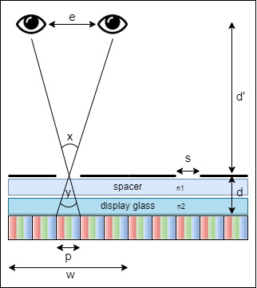

# Parallax-Barrier-Generator
This is a code to generate the Parallax Barrier printable image based on the input parameters and display device specifications.

## Table of Contents

- [Introduction](#introduction)
- [Parallax Barrier Mask Generator](#parallax-barrier-mask-generator)
- [Parallax Barrier Content Generator](#parallax-barrier-content-generator)
- [Parallax Barrier Notes and Challenges](#parallax-barrier-notes-and-challenges)
- [References and Useful Resources](#references-and-useful-resources)

## Introduction

This repository contains code for generating parallax barrier based on display specification and super pixel size. The output is a postscript file.
If you compare the results of the parallax barrier with layer 3d you notice that parallax barrier has lower resolution and less brightness which is the result of using a mask on top of the display and using super pixels. However, parallax barrier supports dynamic content and is cheaper. Layer 3D has higher resolution and brightness but the content is static and also creating polarized slices is more complex than generating super pixels. 

## Parallax Barrier Mask Generator

| Syntax      | Description                             |
| :---:       |    :----                                |
| n1          | Refractive Index of device glass        |
| n2          | Refractive Index of the spacer          |
| p           | Device pixel size                       |
| w           | Super pixel size                        |
| s           | Barrier slit                            |
| d           | Distance between barrier and pixels     |
| d'          | Viewing distance                        |
| e           | Space between eyes                      |

based on Snell's Law we have: n2*sin(x/2)=sin(y/2)

For small angles sin(x)= tan(x) = x Hence n2 * e/2.d' = p/2.d => we can compute the ideal viewer distance;

d'=(e.d/p.n2)

You can use the above formula and put n2 to 1 but make s slightly less than p to account for refraction.

### Alignment and testing barrier correctness

To align the barrier put the barrier on top of the device and rotate it until you can see only one large circle. As the barrier gets more misaligned the number of circles increases, and they become smaller like the picture bellow. If you cannot achieve one circle it is an indication that the barrier slit sizes are too big compared to you device pixel sizes. If the circles do not form at all either the slits are too big, or they are too small. You can zoom in and out of the grid image to see which is the case.

After aligning the barrier, you can test the horizontal parallax using the 1-5 images. If your barrier is correct you should see clear images of 1 to 5 from different angles.

Here is an example of final result:

## Parallax Barrier Content Generator
The content generator contains a python file that creates a 2D image that supports movement parallax (horizontal parallax). 
## Parallax Barrier Notes and Challenges
- If you're only looking for a horizontal parallax only removing the spacer helps with closing the field of view by making it less sensitive to movement.
- For a 3D effect adding the spacer helps with creating a better sense of depth.
- The best parallax barrier mask that you can get with a 1200 dpi printer is for devices with around 114 ppi or less. For any ppi higher than that you need a printer with 5000 or higher for the barrier to be effective.
- Make sure you get transparencies that are suitable for printing and don't print with ink!
- Ensure that the printer's horizontal resolution is as same as the vertical resolution. If horizontal resolution is less than the vertical you can flip the page for printing since the horizontal parallax is more noticeable.
- Ensure that the image dispalying on the device is 1:1 with device pixels.
- Make sure the operating system scaling is set to 100%, in any other value you will not get the effect even if the barrier is correct. 

## Layer 3D Generator
You can use this opengl [application](https://web.media.mit.edu/~gordonw/courses/ComputationalDisplays/GPUSolverSART-1.0.zip) to create polarized slices. All you have to do is to input your the path to your light field aperture folder and changed the config file details.
In the config file you can specify the number of the layers and their location.

### Implementation

## Layer 3D Notes and Challenges
- The size of the spacer that you use need to be equal or lesser than the space between light field slices.
## References and Useful Resources

There are test files at testcontent folder. You can use the doted pic to aligne the barrier and use the 1-5 pic to make sure it is working. other picture are just examples that you can use. The Images are taken from [displayblocks.org](http://displayblocks.org/) assuming a 5x5 super pixel. 

1. Useful DIY resource on 3D displays [[Link](http://displayblocks.org/)] [[Web Archive Link](http://web.archive.org/web/20200711145216/http://displayblocks.org/)]
2. Light Field Archive [[here](https://web.media.mit.edu/~gordonw/SyntheticLightFields/index.php)]
3. The 2012 Siggraph course on computational displayes [[Link](https://web.media.mit.edu/~gordonw/courses/ComputationalDisplays/#notes)]

